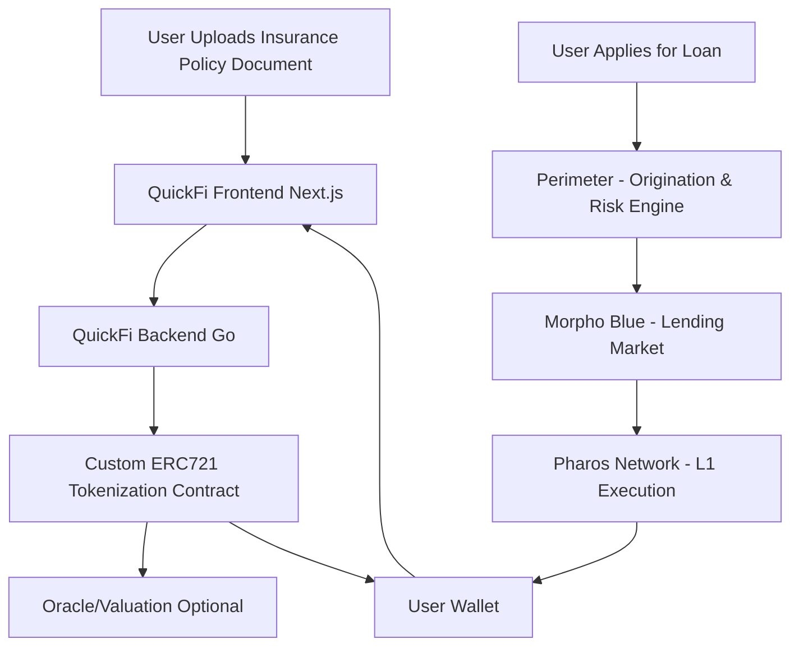

# QuickFi

```mermaid
graph TD
    %% Tokenization Phase
    U1[User Uploads Insurance Policy Document]
    F1[QuickFi Frontend Next.js]
    B1[QuickFi Backend Go]
    T1[Custom ERC721 Tokenization Contract]
    O1[Oracle/Valuation Optional]
    W1[User Wallet]
    
    %% Loan Application Phase
    L1[User Applies for Loan]
    P1[Perimeter - Origination & Risk Engine]
    M1[Morpho Blue - Lending Market]
    PN[Pharos Network - L1 Execution]
    
    %% Tokenization Flow
    U1 --> F1
    F1 --> B1
    B1 --> T1
    T1 --> O1
    T1 --> W1
    W1 --> F1

    %% Loan Origination & Execution Flow
    L1 --> P1
    P1 --> M1
    M1 --> PN
    PN --> W1
```
