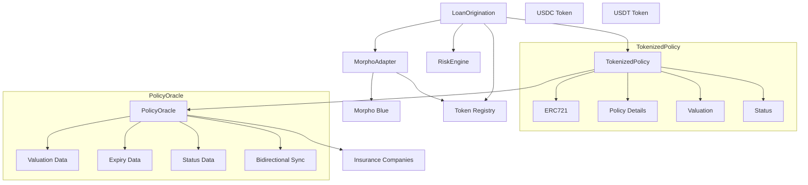

# QuickFi Smart Contract

QuickFi is a decentralized micro-loan platform built on the Pharos Network that enables users to obtain stablecoin loans (USDC, USDT, etc.) backed by tokenized insurance policies.

## Overview

QuickFi consists of several core components:

1. **Tokenization** - Insurance policies are tokenized into on-chain NFTs with valuation data
2. **Risk Assessment** - Loan requests are evaluated based on the tokenized policy valuation
3. **Loan Origination** - Approved loans are processed with the tokenized policy as collateral
4. **Capital Sourcing** - Loans are funded through Morpho Blue's lending markets
5. **Multi-Token Support** - Support for multiple stablecoins through TokenRegistry

## Architecture

For a comprehensive architecture diagram including Oracle integration, please see [architecture_diagram.md](./architecture_diagram.md).

Here's a simplified overview of the core components:



The system is built with a modular architecture:

- `TokenizedPolicy.sol` - ERC721 token for insurance policies with Oracle integration
- `RiskEngine.sol` - Risk assessment for loan applications (from Perimeter Protocol)
- `LoanOrigination.sol` - Loan origination with multi-token support and optional Oracle integration
- `MorphoAdapter.sol` - Interface to Morpho Blue for capital sourcing
- `TokenRegistry.sol` - Registry for supported stablecoins
- `PolicyOracle.sol` - Oracle for policy valuation, expiry date, and status synchronization

The Oracle integration enables:

1. Real-time policy valuation from insurance companies
2. Verification of policy expiry dates
3. Notification to insurance companies when policies default
4. Synchronization of policy status between blockchain and insurance systems

The multi-token support enables:

1. Support for multiple stablecoins (USDC, USDT, etc.)
2. Flexible loan terms based on the stablecoin
3. Easy addition of new stablecoins through TokenRegistry

## Setup and Installation

### Prerequisites

- Node.js v16+
- npm or yarn
- A Pharos Network account with stablecoins (USDC, USDT, etc.)

### Installation

1. Install dependencies:
   ```bash
   npm install
   ```

2. Configure environment variables:
   ```bash
   cp .env.example .env
   ```
   Then edit `.env` with your private key and Pharos RPC URL.

### Compilation

Compile the contracts:

```bash
npm run compile
```

## Testing

### Local Development Environment

1. Start a local Hardhat node:
   ```bash
   npx hardhat node
   ```

2. Deploy contracts to local network (in a new terminal):
   ```bash
   npx hardhat run scripts/deploy.ts --network localhost
   ```

### Running Tests

1. Run all tests:
   ```bash
   npx hardhat test
   ```

2. Run specific test file:
   ```bash
   npx hardhat test test/QuickFi.ts
   ```

3. Run tests with gas reporting:
   ```bash
   REPORT_GAS=true npx hardhat test
   ```

4. Generate test coverage report:
   ```bash
   npx hardhat coverage
   ```

### Testing

1. Use console.log in contracts:
   ```solidity
   import "hardhat/console.sol";
   // In your contract:
   console.log("Value:", someValue);
   ```

2. Use hardhat's trace functionality:
   ```bash
   npx hardhat test --trace
   ```

3. View gas usage with reporter:
   ```bash
   REPORT_GAS=true npx hardhat test
   ```

### Deployment

Deploy the contracts to the Pharos Network:

```bash
npm run deploy
```

For upgradeable contracts:
```bash
npm run deploy:upgradeable
```

## Workflow

1. **Tokenization with Oracle Integration**:
   - User uploads their insurance policy through the QuickFi frontend
   - The policy is tokenized into an ERC721 token with metadata
   - Policy valuation and expiry date are obtained from the Oracle
   - Oracle fetches data from insurance company systems

2. **Stablecoin Selection**:
   - User selects which stablecoin they want to borrow (USDC, USDT, etc.)
   - TokenRegistry verifies that the selected stablecoin is supported
   - Loan terms are adjusted based on the selected stablecoin

3. **Loan Request with Real-time Valuation**:
   - User applies for a loan using their tokenized policy as collateral
   - Risk engine evaluates the application based on current policy value from Oracle
   - If approved, a loan is created in the PENDING state

4. **Loan Activation**:
   - User activates the approved loan
   - Policy token is transferred to the Morpho adapter as collateral
   - Selected stablecoin is borrowed via Morpho Blue and sent to the user

5. **Repayment or Default**:
   - User repays the loan (principal + interest) in the same stablecoin
   - Once fully repaid, the collateral is released back to the user
   - If defaulted, the collateral is liquidated

6. **Insurance Company Notification**:
   - When a loan defaults, the insurance company is notified via Oracle
   - Policy status is updated in insurance company systems
   - Updated status is synchronized back to the blockchain
   - Tokenized policy accurately reflects its real-world status

## Contract Addresses (Pharos Testnet)

- TokenizedPolicy: `0x...`
- RiskEngine: `0x...`
- LoanOrigination: `0x...`
- MorphoAdapter: `0x...`

## Security

This project is for demonstration purposes and has not been audited. Do not use in production without proper security reviews.

## License

MIT

## Future Roadmap

The following features are planned for future development to enhance the protocol's functionality and better align with real-world insurance dynamics:

### 1. Dynamic Policy Valuation

- **Regular Valuation Updates**: Implement automated periodic updates via Chainlink Automation to reflect changes in policy value as premiums are paid over time
- **Valuation Decay Model**: Develop a model that reflects how policy value changes between premium payments
- **Premium Payment Tracking**: Integrate with insurance company systems to track premium payment status

### 2. Enhanced Risk Management

- **Policy Lapse Protection**: Add mechanisms to protect against policy lapses that could affect loan collateral
- **Premium Payment Alerts**: Implement alerts for borrowers when premium payments are due
- **Partial Liquidations**: Allow for partial liquidation of collateral rather than full liquidation

### 3. Advanced Oracle Integration

- **Multi-Oracle Support**: Integrate with multiple oracle providers for redundancy and data verification
- **Insurance Market Data**: Incorporate broader insurance market data for more accurate valuations
- **Automated Claims Detection**: Detect insurance claims through oracle integration and adjust loan terms accordingly

### 4. Improved Liquidation Process

- **Liquidation Warnings**: Implement an off-chain notification system to warn borrowers when approaching liquidation threshold
- **Liquidation Delay**: Add a short delay between when a loan becomes eligible for liquidation and when it can be liquidated
- **Liquidation Incentives**: Implement a liquidation bonus to incentivize liquidators

### 5. Insurance-Specific Features

- **Policy Renewal Handling**: Automatically handle policy renewals to ensure continuous collateral coverage
- **Policy Endorsement Support**: Support for policy endorsements that may affect valuation
- **Multi-Policy Collateralization**: Allow borrowers to use multiple policies as collateral for a single loan

### 6. Enhanced Multi-Token Support

- **Token-Specific Risk Parameters**: Customize risk parameters based on the stablecoin used
- **Interest Rate Models**: Implement different interest rate models for different stablecoins
- **Yield Strategies**: Integrate with yield protocols to generate returns on unused capital
- **Cross-Token Loans**: Allow borrowing in one stablecoin and repaying in another with appropriate exchange rates

## Acknowledgements

- Perimeter Protocol by Circle
- Morpho Blue
- OpenZeppelin Contracts
- Chainlink Oracle Network

## Phraos Hackathon Demo Setup

This section explains how to set up and run the QuickFi protocol demo for the Phraos chain hackathon.

### Overview

For demo purposes, we've created mock implementations of some components:

1. **MockMorphoAdapter**: Simulates interactions with Morpho Blue protocol without actual integration
2. **MockTokenizedPolicy**: Simplified tokenized insurance policy implementation with Oracle integration
3. **MockUSDC**: ERC20 token that simulates USDC for liquidity
4. **MockUSDT**: ERC20 token that simulates USDT for liquidity
5. **MockRiskEngine**: Simulates risk assessment without external dependencies
6. **MockPolicyOracle**: Simulates Chainlink Oracle for policy valuation, expiry date, and status synchronization
7. **LoanOriginationWithOracle**: Enhanced loan origination with insurance company notification
8. **TokenRegistry**: Registry for supported stablecoins
9. **MultiTokenLoanOrigination**: Enhanced loan origination with multi-token support

### Available Scripts

#### Deployment Scripts

1. **Standard Deployment** (`deploy.ts`)
   - Deploys the standard (non-upgradeable) version of the contracts
   - Suitable for testing and initial deployment
   ```bash
   npx hardhat run scripts/deploy.ts --network localhost
   ```

2. **Upgradeable Deployment** (`deploy-upgradeable.ts`)
   - Deploys the upgradeable version of the contracts using proxy pattern
   - Recommended for production deployments
   ```bash
   npx hardhat run scripts/deploy-upgradeable.ts --network localhost
   ```

3. **Upgrade Implementation** (`upgrade-implementation.ts`)
   - Upgrades the implementation of upgradeable contracts
   - Used for updating contract logic without changing storage
   ```bash
   IMPL_TYPE=TOKENIZED_POLICY npx hardhat run scripts/upgrade-implementation.ts --network localhost
   ```

#### Demo Scripts

1. **Simple Demo** (`demo_simple.js`)
   - Demonstrates core functionality with Oracle integration
   - Simplified mock components for easy understanding
   ```bash
   npx hardhat run scripts/demo_simple.js --network localhost
   ```

2. **Comprehensive Demo** (`demo_comprehensive.js`)
   - Full contract interactions with proper error handling
   - More realistic demonstration of the protocol
   ```bash
   npx hardhat run scripts/demo_comprehensive.js --network localhost
   ```

The demo scripts have been updated to demonstrate multi-token support.

### Demo Setup Instructions

1. Clone the repository:

```bash
git clone https://github.com/your-org/quickfi-contract.git
cd quickfi-contract
```

2. Install dependencies:

```bash
npm install
# or
yarn install
```

3. Create a `.env` file based on `.env.example` and set your environment variables.

4. Start a local Hardhat node:

```bash
npx hardhat node
```

5. In a new terminal, run one of the demo scripts:

```bash
npx hardhat run scripts/demo_simple.js --network localhost
```

### Demo Flow

The demo flow includes:

1. Setting up mock contracts including the PolicyOracle
2. Minting tokenized insurance policy NFTs with Oracle integration
3. Obtaining policy valuation and expiry date from the Oracle
4. Creating loan requests with insurance policies as collateral
5. Funding loans based on Oracle-provided valuations
6. Repaying loans
7. Demonstrating liquidation in case of default
8. Notifying insurance companies about defaults via Oracle
9. Synchronizing policy status between blockchain and insurance systems

We provide two demo scripts:

1. **Simple Demo** (`scripts/demo_simple.js`): Basic functionality with Oracle integration and multi-token support
2. **Comprehensive Demo** (`scripts/demo_comprehensive.js`): Full contract interactions including bidirectional Oracle communication and multi-token support

This demo flow demonstrates the key functionality of QuickFi protocol, including Oracle integration for real-time policy data, insurance company synchronization, and multi-token support.
