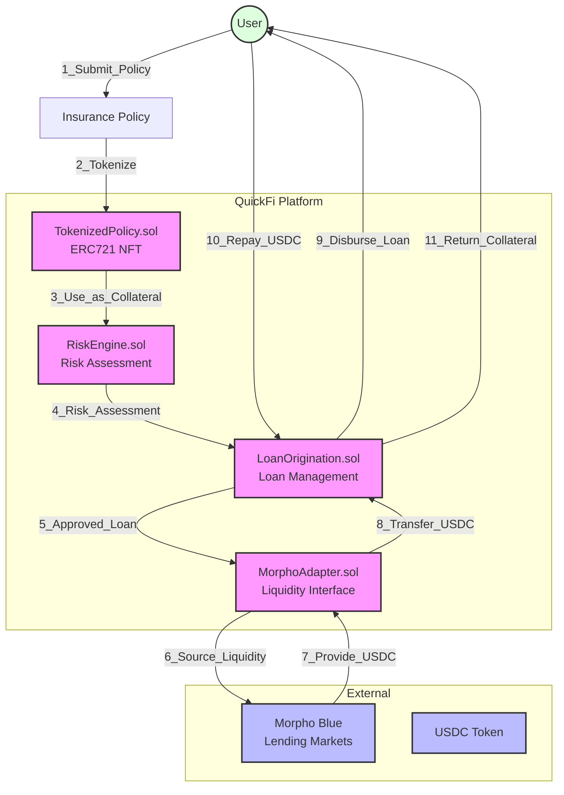

# QuickFi Smart Contract

QuickFi is a decentralized micro-loan platform built on the Pharos Network that enables users to obtain USDC loans backed by tokenized insurance policies.

## Overview

QuickFi consists of several core components:

1. **Tokenization** - Insurance policies are tokenized into on-chain NFTs with valuation data
2. **Risk Assessment** - Loan requests are evaluated based on the tokenized policy valuation
3. **Loan Origination** - Approved loans are processed with the tokenized policy as collateral
4. **Capital Sourcing** - Loans are funded through Morpho Blue's lending markets

## Architecture



The system is built with a modular architecture:

- `TokenizedPolicy.sol` - ERC721 token for insurance policies (representing Plume)
- `RiskEngine.sol` - Risk assessment for loan applications (from Perimeter Protocol)
- `LoanOrigination.sol` - Loan origination and management (from Perimeter Protocol)
- `MorphoAdapter.sol` - Interface to Morpho Blue for capital sourcing

## Setup and Installation

### Prerequisites

- Node.js v16+
- npm or yarn
- A Pharos Network account with USDC

### Installation

1. Install dependencies:
   ```bash
   npm install
   ```

2. Configure environment variables:
   ```bash
   cp .env.example .env
   ```
   Then edit `.env` with your private key and Pharos RPC URL.

### Compilation

Compile the contracts:

```bash
npm run compile
```

## Testing

### Local Development Environment

1. Start a local Hardhat node:
   ```bash
   npx hardhat node
   ```

2. Deploy contracts to local network (in a new terminal):
   ```bash
   npx hardhat run scripts/deploy.ts --network localhost
   ```

### Running Tests

1. Run all tests:
   ```bash
   npx hardhat test
   ```

2. Run specific test file:
   ```bash
   npx hardhat test test/QuickFi.ts
   ```

3. Run tests with gas reporting:
   ```bash
   REPORT_GAS=true npx hardhat test
   ```

4. Generate test coverage report:
   ```bash
   npx hardhat coverage
   ```

### Testing

1. Use console.log in contracts:
   ```solidity
   import "hardhat/console.sol";
   // In your contract:
   console.log("Value:", someValue);
   ```

2. Use hardhat's trace functionality:
   ```bash
   npx hardhat test --trace
   ```

3. View gas usage with reporter:
   ```bash
   REPORT_GAS=true npx hardhat test
   ```

### Deployment

Deploy the contracts to the Pharos Network:

```bash
npm run deploy
```

For upgradeable contracts:
```bash
npm run deploy:upgradeable
```

## Workflow

1. **Tokenization**:
   - User uploads their insurance policy through the QuickFi frontend
   - The policy is tokenized into an ERC721 token with metadata
   - Token contains valuation data for LTV calculations

2. **Loan Request**:
   - User applies for a loan using their tokenized policy as collateral
   - Risk engine evaluates the application based on policy value
   - If approved, a loan is created in the PENDING state

3. **Loan Activation**:
   - User activates the approved loan
   - Policy token is transferred to the Morpho adapter as collateral
   - USDC is borrowed via Morpho Blue and sent to the user

4. **Repayment**:
   - User repays the loan (principal + interest)
   - Once fully repaid, the collateral is released back to the user
   - If defaulted, the collateral can be liquidated

## Contract Addresses (Pharos Testnet)

- TokenizedPolicy: `0x...`
- RiskEngine: `0x...`
- LoanOrigination: `0x...`
- MorphoAdapter: `0x...`

## Security

This project is for demonstration purposes and has not been audited. Do not use in production without proper security reviews.

## License

MIT

## Acknowledgements

- Perimeter Protocol by Circle
- Morpho Blue
- OpenZeppelin Contracts
