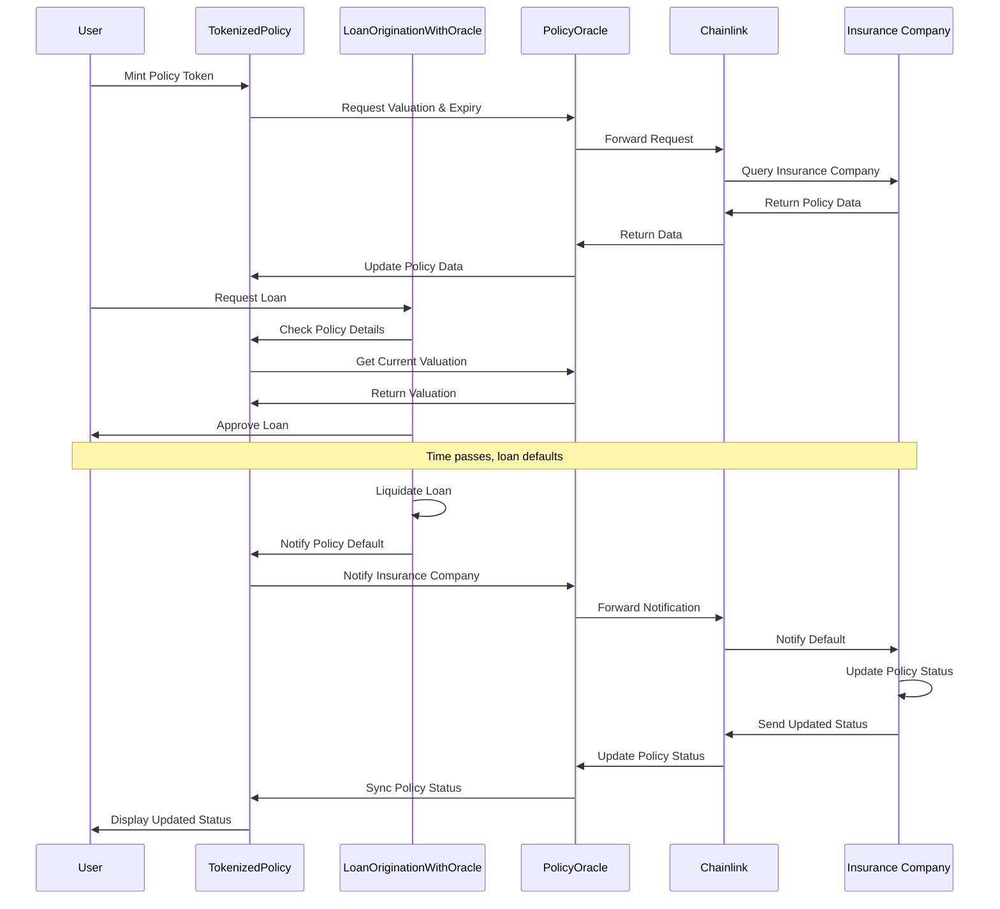
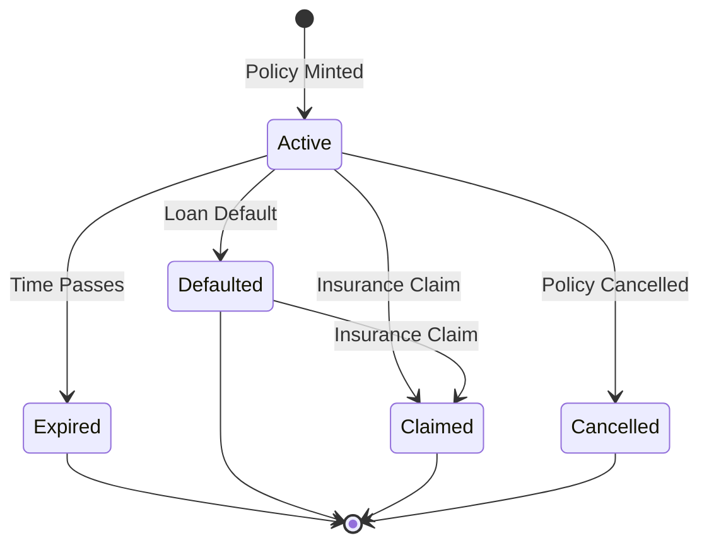

# QuickFi Architecture Diagram

This architecture diagram illustrates the QuickFi protocol's components and their interactions, including the Oracle integration for policy valuation, expiry date, and status synchronization with insurance companies.

## System Architecture

```mermaid
graph TD
    %% Core Contracts
    LO[LoanOrigination]
    LOW[LoanOriginationWithOracle]
    RE[RiskEngine]
    TP[TokenizedPolicy]
    MA[MorphoAdapter]
    PO[PolicyOracle]

    %% Interfaces
    ILO[ILoanOrigination]
    IRE[IRiskEngine]
    ITP[ITokenizedPolicy]
    IMA[IMorphoAdapter]
    IPO[IPolicyOracle]

    %% External Protocols & Dependencies
    MB[Morpho Blue]
    USDC[USDC Token]
    IC[Insurance Companies]
    CL[Chainlink Network]

    %% Interface Implementations
    ILO --> LO
    ILO --> LOW
    IRE --> RE
    ITP --> TP
    IMA --> MA
    IPO --> PO

    %% Contract Dependencies
    LO --> RE
    LO --> MA
    LO --> TP
    LO --> USDC

    LOW --> RE
    LOW --> MA
    LOW --> TP
    LOW --> USDC
    LOW --> PO

    TP --> PO
    RE --> TP
    MA --> MB
    MA --> USDC
    PO --> CL
    CL --> IC

    %% Access Control
    AC[AccessControl]
    RG[ReentrancyGuard]
    UP[Upgradeable]

    AC --> LO
    AC --> LOW
    AC --> RE
    AC --> TP
    AC --> MA
    AC --> PO

    RG --> LO
    RG --> LOW
    RG --> MA

    UP --> TP

    %% Contract Features
    subgraph TokenizedPolicy
        TP --> NFT[ERC721]
        TP --> POL[Policy Details]
        TP --> VAL[Valuation]
        TP --> STAT[Policy Status]
    end

    subgraph LoanOriginationWithOracle
        LOW --> LOAN[Loan Management]
        LOW --> RISK[Risk Assessment]
        LOW --> COLL[Collateral Management]
        LOW --> NOTIF[Default Notification]
    end

    subgraph PolicyOracle
        PO --> VALDATA[Valuation Data]
        PO --> EXPDATA[Expiry Data]
        PO --> STATDATA[Status Data]
        PO --> NOTIFY[Insurance Notification]
        PO --> SYNC[Bidirectional Sync]
    end

    subgraph RiskEngine
        RE --> ASSESS[Risk Assessment]
        RE --> PARAMS[Risk Parameters]
        RE --> ORACLE[Price Oracle]
    end

    subgraph MorphoAdapter
        MA --> MARKET[Market Management]
        MA --> POS[Position Management]
        MA --> LIQ[Liquidation]
    end

    %% Data Flow
    SYNC --> IC
    IC --> SYNC

    %% Oracle Data Flow
    classDef oracleFlow fill:#f9f,stroke:#333,stroke-width:2px;
    class PO,VALDATA,EXPDATA,STATDATA,NOTIFY,SYNC oracleFlow;

    %% Contract Roles
    ROLES[Contract Roles]
    ROLES --> |ADMIN| LO
    ROLES --> |ADMIN| LOW
    ROLES --> |LIQUIDATOR| LO
    ROLES --> |LIQUIDATOR| LOW
    ROLES --> |LOAN_MANAGER| LO
    ROLES --> |LOAN_MANAGER| LOW
    ROLES --> |MINTER| TP
    ROLES --> |UPGRADER| TP
    ROLES --> |RISK_MANAGER| RE
    ROLES --> |ORACLE_ROLE| PO
```

## Oracle Integration Flow

## Policy Status State Machine

## Key Components

1. **TokenizedPolicy**: ERC721 token representing insurance policies with Oracle integration for valuation, expiry date, and status.

2. **PolicyOracle**: Oracle interface that provides bidirectional communication with insurance companies via Chainlink.

3. **LoanOriginationWithOracle**: Enhanced loan origination contract that notifies insurance companies when loans default.

4. **RiskEngine**: Risk assessment engine that evaluates loan applications based on policy valuation from the Oracle.

5. **MorphoAdapter**: Interface to Morpho Blue for capital sourcing.

## Oracle Integration Benefits

1. **Real-time Valuation**: Access to current policy valuations ensures loans are based on accurate data.

2. **Dynamic Risk Assessment**: As policy valuations change, loan parameters adjust automatically.

3. **Expiry Date Verification**: The protocol verifies policies are not expired before issuing loans.

4. **Policy Status Synchronization**: When loans default, insurance companies are notified, and policy status is synchronized.

5. **Bidirectional Communication**: The protocol stays in sync with insurance company systems, ensuring tokenized policies accurately reflect their real-world status.

## Future Enhancements

The architecture will be extended to support these planned features:

1. **Dynamic Policy Valuation**: As users continue to pay premiums to insurance companies, policy valuations will change over time. The Oracle will be enhanced to track premium payments and update valuations accordingly.

2. **Premium Payment Tracking**: The Oracle will monitor premium payment status to ensure policies remain active and valid as collateral.

3. **Policy Renewal Handling**: Automated handling of policy renewals to maintain continuous collateral coverage.

4. **Enhanced Liquidation Process**: Improved liquidation mechanisms including warnings, delays, and partial liquidations.

These enhancements will ensure the protocol accurately reflects real-world insurance dynamics and provides better protection for both borrowers and lenders.
